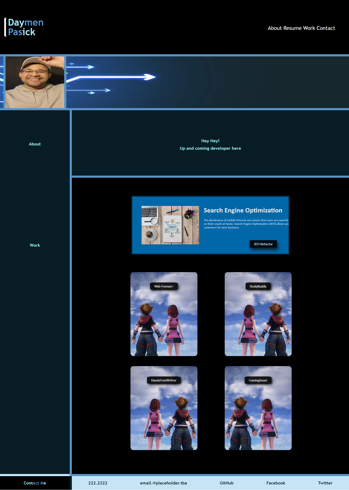

# css-portfolio-challenge

## Description

First and foremost, thank you for taking the time to look at my portfolio! I've been coding for about a month now and have enjoyed every bit of it..the challenges, the learning, the interactive problem-solving with fellow student programers, even the countless hours of research to acheive desired goals. If you hire me on, I can assure you I'll bring the same energy and mentality to your team. But don't let me keep you, go ahead and check out my portfolio!

## Screenshots

- Image of my CSS portfolio

## Usage

Please click the link to check out my portfolio: 
https://daymenpasick.github.io/css-portfolio-challenge/

## License

N/A
